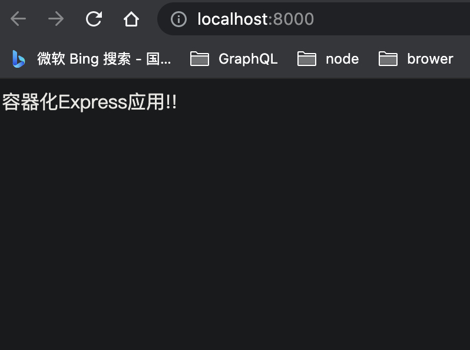

# Docker for 开发：容器化Express应用

### 前言

开发阶段容器化Express应用，运行采用**nodemon**。整个过程可以总结为以下三点：

- 使用 Dockerfile 定义应用程序的环境。
- 使用 docker-compose.yml 定义构成应用程序的服务，这样它们可以在隔离环境中一起运行。
- 最后，执行 docker-compose up 命令来启动并运行整个应用程序。

代码仓库地址：

### 创建一个Express应用

创建文件夹，初始化项目

```bash
mkdir docker-express 
cd docker-express
```

初始化项目,这里采用默认

```bash
npm init -y
```

开发环境中，用**nodemon**运行应用，所以添加**nodemon**和**express**依赖

```bash
npm install express
npm install nodemon --save-dev
```

创建一个index.js 文件，添加如下内容

```javascript
const express = require('express');

const app = express();
const PORT = process.env.PORT || 8000;

app.use('/',(req,res,next) => {
    res.send('<p>容器化Express应用!!</p>')
});
app.listen(PORT, () => console.log(`Server listening on port ${PORT}! http://localhost:8000`));
```

在**package.json**文件中编辑**scripts**

```json
{
  "name": "docker-express",
  "version": "1.0.0",
  "description": "",
  "main": "index.js",
  "scripts": {
    "start": "node index.js",
    "dev": "nodemon index.js"
  },
  "author": "",
  "license": "ISC",
  "dependencies": {
    "express": "^4.17.1"
  },
  "devDependencies": {
    "nodemon": "^2.0.12"
  }
}
```

一个简单的express应用已经创建完毕，运行起来看一下效果：

```bash
npm run dev
```




### 创建**Dockerfile**和.**dockerignore** 文件

Dockerfile是由一系列命令和参数构成的脚本，这些命令应用于基础镜像并最终创建一个新的镜像。它们简化了从头到尾的流程并极大的简化了部署工作。Dockerfile从FROM命令开始，紧接着跟随者各种方法，命令和参数。其产出为一个新的可以用于创建容器的镜像

在根目录下面创建两个文件**Dockerfile**和.**dockerignore** 

```bash
touch Dockerfile .dockerignore
```

Dockerfile 文件添加如下内容：

```yaml
# 基础镜像 Node 版本为12
FROM node:12 as base
# 设置工作目录，对RUN,CMD,ENTRYPOINT,COPY,ADD生效。如果不存在则会创建，也可以设置多次。
# 在一台机器中，用这个镜像创建一个容器时，相对于这台机器的根目录下面的src文件夹
WORKDIR /src
# 需要package.json 告诉程序运行需要安装的依赖。所以拷贝了package.json和package-lock.json到工作目录
COPY package*.json ./
# EXPOSE用来指定端口，使容器内的应用可以通过端口和外界交互
# 但是EXPOSE并不会使容器访问主机的端口
# 如果想使得容器与主机的端口有映射关系，必须在容器启动的时候加上 -P参数 
# 语法：EXPOSE <port>/<tcp/udp>
EXPOSE 8000
# 这一步和第一步很像，从base镜像创建一个开发环境的镜像
FROM base as dev
# ENV命令用于设置环境变量。这些变量以”key=value”的形式存在，并可以在容器内被脚本或者程序调用。
# 设置development 环境
ENV NODE_ENV=development
# RUN指令在构建时将会生成一个新的镜像层，并且执行RUN指令后面的内容
RUN npm install
# COPY 命令 指从外部往容器内添加文件。但是COPY指令只支持基本的文件和文件夹拷贝功能
COPY . .
# 和RUN命令相似，CMD可以用于执行特定的命令。
# 和RUN不同的是，这些命令不是在镜像构建的过程中执行的，而是在用镜像构建容器后被调用
CMD ["npm", "run", "dev"]
```

在.dockerignore文件里面添加忽略

```yaml
.git
node_modules
```

上面我们排除了`.git`和`node_modules`


### docker-compose.yml简介

`docker-compose.yml`在容器编排中使用。举个栗子，一个项目运行，需要node镜像，mongodb镜像，nginx镜像。如果没有docker-compose，那么每次启动的时候，你需要手动的启动三个镜像创建的容器，并且需要通过命令参数处理**容器之间的衔接关系**，。而用了docker-composer之后，你就可以把这些命令一次性写在docker-composer.yml文件中，以后每次启动这一整个环境（含3个容器）的时候，只需要运行`docker-composer up`命令就足够了。

Docker Compose 文件主要分为三部分： services（服务）、networks（网络） 和 volumes（数据卷）

- services：服务定义了容器启动的各项配置，就像我们执行docker run命令时传递的容器启动的参数一样，指定了容器应该如何启动，例如容器的启动参数，容器的镜像和环境变量等。

- networks：网络定义了容器的网络配置，就像我们执行docker network create命令创建网络配置一样。

- volumes：数据卷定义了容器的卷配置，就像我们执行docker volume create命令创建数据卷一样。

每一部分都需要如何配置，由于内容太多，这里不做展开讲解，有兴趣的可以查看一下这篇文章：https://www.runoob.com/docker/docker-compose.html

一个典型的 Docker Compose 文件结构如下：

```
version: "3"
services:
  nginx:
    ## ... 省略部分配置
networks:
  frontend:
  backend:
volumes:
  db-data:
```


### 创建**docker-compose.yml** 文件

在项目根目录下面创建 一个`docker-compose.yml`文件

```bash
touch docker-compose.yml
```

添加如下内容

```yaml
services:
    web:
        build:
            context: ./
            target: dev
        volumes:
            - .:/src
        command: npm run dev
        ports: 
            - "8000:8000"
        environment:
            NODE_ENV: development
```

在`services`下面创建了一个`web`服务

接下来分段讲解一下，**docker-compose.yml** 文件内容。

```yml
build:
    context: ./
    target: dev
```

`context` 指定为构建镜像上下文路径，`target`指定了构建镜像的阶段是开发阶段 development


```yml
volumes:
    # - 主机(源路径)：容器(目标路径)
    # - /var/lib/mysql:/var/lib/mysql
    - . : /src
```

volumes： 不仅可以挂载主机数据卷到容器中，也可以直接挂载主机的目录到容器中。上面命令 将主机当前目录，映射到容器的src文件夹下面。主机当前目录下面任何代码的修改，都会映射到 容器src下面。这样带来的一个好处，每次代码更改不需要重新创建容器。


```yml
command: npm run dev
```

当容器被创建的时候，自动执行 npm run  dev 命令


```yml
ports: 
    # -  主机端口：容器端口
    - "8000:8000"
```

端口映射


```
environment:
    NODE_ENV: development
```

指定node服务的运行环境是development

### 创建和运行docker容器

创建docker镜像，如下

```bash
docker-compose build
```

在docker容器中运行node应用程序，并且通过8000暴露给主机

```
docker-compose up
```


### 参考文献

- https://www.jianshu.com/p/2232baf1219a 
- http://dockone.io/article/2239
- 《dockerfile 与 docker-compose的区别》https://blog.csdn.net/DDFFR/article/details/77049118

